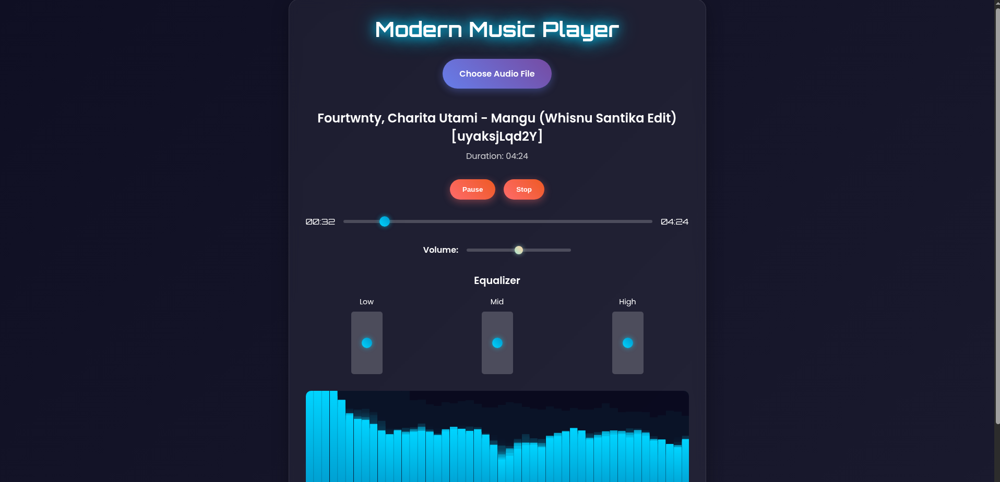

# Modern Music Player

A sleek, modern, and responsive music player web application with audio visualization, equalizer controls, and futuristic UI design. Built with HTML, CSS, and JavaScript, featuring Web Audio API for advanced audio processing.



## Features

### Core Functionality
- **Local File Upload**: Select and play audio files directly from your device (supports all common audio formats)
- **Playback Controls**: Play, Pause, and Stop buttons with intuitive interface
- **Progress Bar**: Interactive seek bar to jump to any part of the track
- **Volume Control**: Adjustable volume slider
- **Time Display**: Real-time current time and total duration display

### Advanced Features
- **Audio Visualizer**: Real-time spectrum analyzer with animated bars that respond to music beats
- **Equalizer**: 3-band equalizer (Low, Mid, High) for fine-tuning audio frequencies
- **Theme Changer**: Multiple color themes for visualizer and UI elements
- **Responsive Design**: Optimized for both desktop and mobile devices
- **Smooth Animations**: Neon glow effects and smooth transitions for a futuristic look

### Technical Highlights
- **Web Audio API**: Used for audio processing, visualization, and equalizer
- **Canvas Rendering**: Custom visualizer with gradient effects
- **Modern CSS**: Flexbox, CSS Grid, and advanced animations
- **Google Fonts**: Orbitron and Poppins for typography
- **No Server Required**: Runs entirely in the browser, no backend needed

## Demo

Live demo available at: [Vercel Deployment URL](https://your-vercel-url.vercel.app) (replace with actual URL after deployment)

## Screenshots

### Desktop View


### Mobile View


## Technologies Used

- **Frontend**: HTML5, CSS3, JavaScript (ES6+)
- **Audio Processing**: Web Audio API
- **Visualization**: HTML5 Canvas
- **Fonts**: Google Fonts (Orbitron, Poppins)
- **Deployment**: Vercel
- **Version Control**: Git

## Installation & Setup

### Local Development

1. **Clone the repository**
   ```bash
   git clone https://github.com/kangsantri/musicplayers.git
   cd musicplayers
   ```

2. **Open in browser**
   - Simply open `index.html` in your web browser
   - No server required for local development

### Online Deployment

The project is configured for easy deployment on Vercel:

1. **Connect to Vercel**
   - Go to [vercel.com](https://vercel.com)
   - Import your GitHub repository
   - Vercel will automatically detect and deploy the static site

2. **Manual Deployment**
   - Install Vercel CLI: `npm i -g vercel`
   - Run `vercel` in the project directory
   - Follow the prompts to deploy

## Usage

1. **Load Music**: Click "Choose Audio File" to select an audio file from your device
2. **Playback**: Use Play/Pause/Stop buttons to control playback
3. **Seek**: Drag the progress bar to jump to different parts of the track
4. **Volume**: Adjust the volume slider
5. **Equalizer**: Use the Low, Mid, and High sliders to adjust audio frequencies
6. **Themes**: Click "Change Theme" to cycle through different visualizer color schemes

## Browser Compatibility

- Chrome 14+
- Firefox 25+
- Safari 6+
- Edge 12+

*Note: Web Audio API requires a modern browser. For best experience, use the latest version of Chrome or Firefox.*

## Project Structure

```
musicplayers/
├── index.html          # Main HTML structure
├── styles.css          # CSS styling and animations
├── script.js           # JavaScript logic and audio processing
├── vercel.json         # Vercel deployment configuration
├── README.md           # Project documentation
└── TODO.md             # Development notes
```

## Customization

### Adding New Themes

Edit the `themes` array in `script.js`:

```javascript
const themes = [
    { primary: '#00d4ff', secondary: '#0099cc', accent: '#667eea' },
    { primary: '#ff6b6b', secondary: '#ee5a24', accent: '#764ba2' },
    // Add your custom theme here
];
```

### Modifying Equalizer Bands

Adjust frequency ranges in the `initAudioContext()` function:

```javascript
lowFilter.frequency.value = 320;   // Low frequency cutoff
midFilter.frequency.value = 1000;  // Mid frequency center
highFilter.frequency.value = 3200; // High frequency cutoff
```

### Changing Visualizer Appearance

Modify the `drawVisualizer()` function to customize the visualizer bars, colors, and animation.

## Contributing

1. Fork the repository
2. Create a feature branch: `git checkout -b feature-name`
3. Commit your changes: `git commit -am 'Add new feature'`
4. Push to the branch: `git push origin feature-name`
5. Submit a pull request

## License

This project is open source and available under the [MIT License](LICENSE).

## Acknowledgments

- Web Audio API documentation
- Google Fonts for typography
- Vercel for hosting platform
- Inspiration from modern music player interfaces

## Support

If you find this project helpful, please give it a ⭐ on GitHub!

For questions or issues, open an issue on the GitHub repository.

---

**Enjoy your music with style! 🎵**
